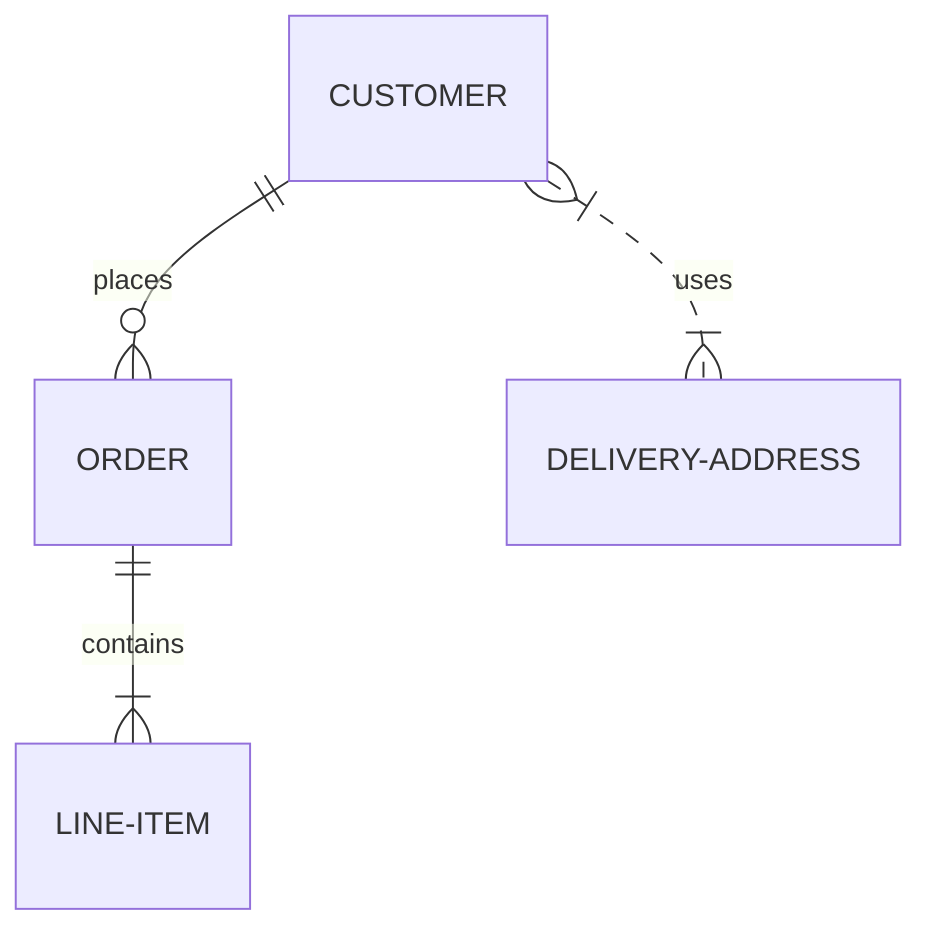

##This is a testfile



```mermaid
sequenceDiagram
    participant Client
    participant Twix
    participant SVR
    Client->>Twix: InitiatePhoneNumberVerification 
    Twix->>Client: InitiatePhoneNumberVerificationResponse
    Client->>Twix: VerifyPhoneNumber
    Twix->>Client: VerifyPhoneNumberResponse
    Login Token is Granted


    If Existing User:
    Client->>Twix: InitiateEmailAddressVerification
    Twix->>Client:
    
    
    
    viewscreen->>iframe: html & javascript
    iframe->>dotcom: iframe ready
    dotcom->>iframe: set mermaid data on iframe
    iframe->>iframe: render mermaid
```
