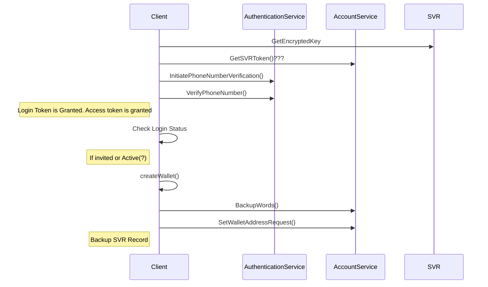
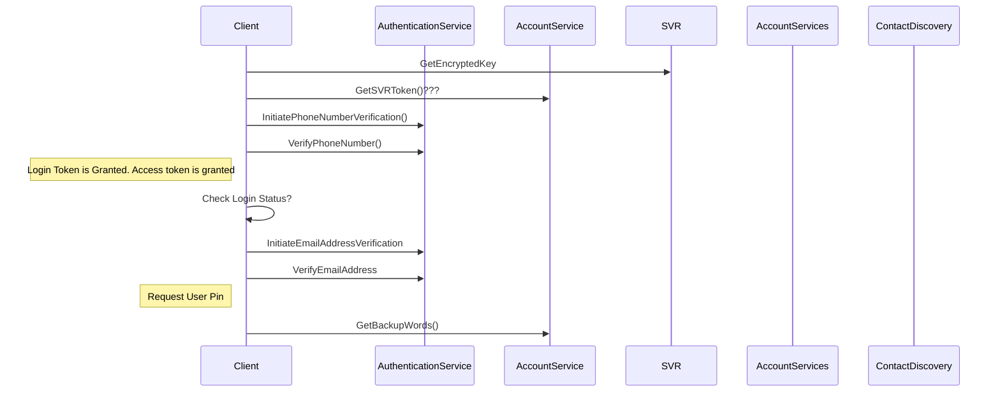

New User Flow

```mermaid
sequenceDiagram
    participant Client
    participant AuthenticationService
    participant AccountService
    participant SVR
    Client->>SVR: GetEncryptedKey
    Client->>AccountService: GetSVRToken()???
    Client->>AuthenticationService: InitiatePhoneNumberVerification() 
    Client->>AuthenticationService: VerifyPhoneNumber()
    
    Note left of Client: Login Token is Granted. Access token is granted
    Client->>Client: Check Login Status
    Note left of Client: If invited or Active(?)
    Client->>Client: createWallet()
    Client->>AccountService: BackupWords()

    Client->>AccountService:SetWalletAddressRequest()
    Note left of Client: Backup SVR Record    
    
```

Existing User Flow

```mermaid
sequenceDiagram
    participant Client
    participant AuthenticationService
    participant AccountService
    participant SVR
    Client->>SVR: GetEncryptedKey
    Client->>AccountService: GetSVRToken()???
    Client->>AuthenticationService: InitiatePhoneNumberVerification() 
    Client->>AuthenticationService: VerifyPhoneNumber()
    
    Note left of Client: Login Token is Granted. Access token is granted
    Client->>Client: Check Login Status?

    

    Client->>AuthenticationService: InitiateEmailAddressVerification
    Client->>AuthenticationService: VerifyEmailAddress    
    Note left of Client: Request User Pin

    Client->>AccountService: GetBackupWords()    
    
    
    
    
    
    participant AccountServices
    participant ContactDiscovery
    

```

